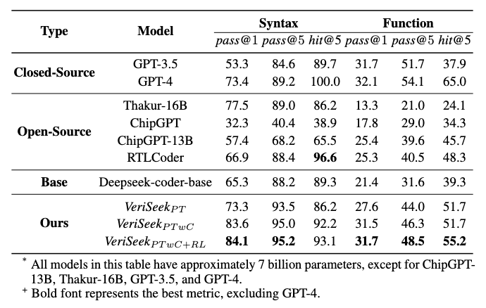

# Veriseek

Official implement of paper "Large Language Model for Verilog Generation with Golden Code Feedback". The best model weight is available at https://huggingface.co/WANGNingroci/VeriSeek.



## Table of Contents
- [Update Log](#update-log)
- [Project Description](#project-description)
- [Installation](#installation)
- [Usage](#usage)
    - [Generation](#Generation)
    - [Pretrain](#Pretrain)
    - [PPO](#PPO)
- [Acknowledgement](#Acknowledgement)

## Update Log
- 2024.07.22: Initial version of Veriseek. Add training code and config file.

## Project Description
This study introduces a novel approach utilizing reinforcement learning with golden code feedback to enhance the performance of pre-trained models. Leveraging open-source data and base models, we have achieved state- of-the-art (SOTA) results with a substantial margin. Notably, our 6.7B parameter model VeriSeek demonstrates superior performance compared to current best-in- class 13B and 16B models. Furthermore, through a comprehensive analysis of the limitations in direct fine-tuning and the training dynamics of reinforcement learning, we posit that the development of comprehensive supervisory signals, which are align with the inherent parallel semantics of Verilog code, is critical to effective generation. 

## Installation
To install this project, follow these steps:

1. Clone the repository: `git clone https://github.com/CatIIIIIIII/veriseek.git`
2. Navigate to the project directory: `cd veriseek`
3. Install the dependencies: `conda env create -f environment.yml`

## Usage

Before training, you should configure the `src/scripts/single_node.sh` file for training, `src/configs/accelerate/accel.yaml` for accelerate, `src/configs/deepspeed/ds_z3_config.json` for deepspeed. The configuration file contains the following options:

### Generation

To generate reponse, run the following demo:

```python
import torch
from transformers import AutoTokenizer, AutoModelForCausalLM

def stop_at_stop_token(decoded_string, stop_tokens):
    """
    Produces the prefix of decoded_string that ends at the first occurrence of
    a stop_token.
    WARNING: the decoded_string *must not* include the prompt, which may have stop tokens
    itself.
    """
    min_stop_index = len(decoded_string)
    for stop_token in stop_tokens:
        stop_index = decoded_string.find(stop_token)
        if stop_index != -1 and stop_index < min_stop_index:
            min_stop_index = stop_index
    return decoded_string[:min_stop_index]
    
    
prompt = """
Please act as a professional verilog designer.

Implement a data width conversion circuit that converts 8-bit data input to 16-bit data output. The module provides two output ports: valid_out, which indicates the validity of the output data, and data_out, which represents the converted 16-bit output data. The first arriving 8-bit data should be placed in the higher 8 bits of the 16-bit data output. The valid_out and data_out signals are generated in the next clock cycle after the two data inputs. When there is only one data input, valid_out and data_out are not generated immediately. Instead, they wait for the arrival of the next data input to complete the concatenation of the two data inputs before generating valid_out and data_out. 

Module name:  
    width_8to16   

Input ports:
    clk: Clock signal used for synchronous operation.
    rst_n: Active-low reset signal. Defined as 0 for reset and 1 for reset signal inactive.
    valid_in: Input signal indicating the validity of the input data.
    data_in: 8-bit input data to be converted.

Output ports:
    valid_out: Output signal indicating the validity of the output data.
    data_out: 16-bit output data resulting from the width conversion.
Implementation:
The data_out register is triggered on the positive edge of the clock signal (posedge clk) or the negative edge of the reset signal (negedge rst_n).
On reset, indicated by !rst_n, the data_out register is cleared to 0.
If the input data is valid (valid_in) and the flag signal is active, the data_out register is updated by concatenating the contents of the data_lock register (8 bits) and the data_in register (8 bits) to form a 16-bit output. The first valid data is temporarily stored, and when the second valid data is inputted, they are concatenated to produce the output valid_out and data_out.

Give me the complete code.

"""

gpu_id = 0
model_name = "WANGNingroci/VeriSeek"
tokenizer = AutoTokenizer.from_pretrained(model_name)
model = AutoModelForCausalLM.from_pretrained(model_name, torch_dtype=torch.float16, device_map=gpu_id)
model.eval()
# Sample
input_ids = tokenizer(prompt, return_tensors="pt").input_ids.to(gpu_id)
sample = model.generate(input_ids, max_length=1024, temperature=0.2, top_p=0.95, do_sample=True)
output = tokenizer.decode(sample[0])

stop_word = "endmodule"
output_trunc = stop_at_stop_token(output, [stop_word])
output_trunc += "endmodule"
print(output_trunc)
```

### Pretrain
The pretraining data is available at https://huggingface.co/datasets/WANGNingroci/vgen_cpp. Download and put it in the `data/pretrain` directory.
To pretrain the model, run the following command:

```bash
bash src/scripts/single_node.sh src/configs/pretrain/deepseek-7B.yaml
```

### PPO
The reinforcement learning algorithm used in this project is Proximal Policy Optimization (PPO). Opencores data is available at https://huggingface.co/datasets/WANGNingroci/opencores. Download and put it in the `data/opencores` directory. To train the model with PPO, run the following command:

```bash
bash src/scripts/single_node.sh src/configs/preference/deepseek-7B_ppo_ast.yaml
```

## Acknowledgement
This repo benefits from [LLaMA-Factory](https://github.com/hiyouga/LLaMA-Factory). Thanks for their wonderful works.